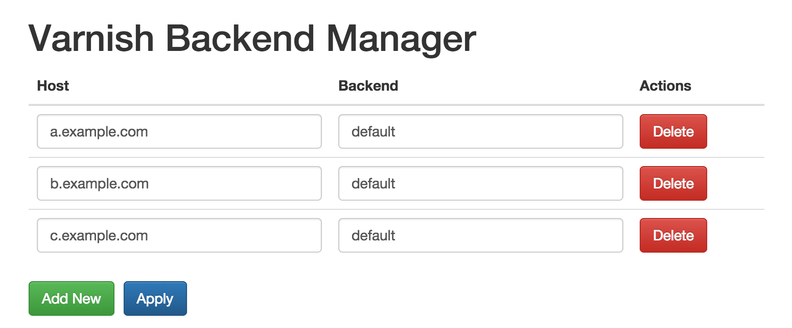

Introduction
============

Varnish Backend Manager is a single binary utility designed to generate a VCL
fragment for inclusion into a Varnish configuration file (i.e. default.vcl).
The tool allows the user match host headers `req.http.host` with the backend
intended to serve them, effectively turning Varnish into a HTTP switch.vcl:

Gets turned into the following VCL:

	if (req.http.host == "a.example.com") {
	  set req.backend_hint = default;
	}
		
	if (req.http.host == "b.example.com") {
	  set req.backend_hint = default;
	}
		
	if (req.http.host == "c.example.com") {
	  set req.backend_hint = default;
	}

Building
========

Download the source:

	go get github.com/cjdell/varnish-backend-manager 

	go get -u github.com/jteeuwen/go-bindata/...
	
	cd $GOPATH/src/github.com/cjdell/varnish-backend-manager

Bundle assets:

	go-bindata assets/

Build the binary:

	go build

Run the binary:

	./varnish-backend-manager <listenAddressAndPort> <password>
	
i.e.:

	./varnish-backend-manager localhost:8083 s3cr3t
	
Use `localhost:[port]` for internal access only, or via SSH tunnel. For public 
access, an external IP may be used.
	
Build for other platforms
=========================

Load the cross compiler helper utilities:

	source crosscompile.bash

Build the toolchain for Linux 64 bit (other platforms see [http://dave.cheney.net/2012/09/08/an-introduction-to-cross-compilation-with-go]):

	go-crosscompile-build linux/amd64
	
Cross compile changes directory so go back to the source:
	
	cd $GOPATH/src/github.com/cjdell/varnish-backend-manager
	
Bundle assets:

	go-bindata assets/

Build the binary:
	
	go-linux-amd64 build

Applying configuration
======================

Symlink the VCL file "output/switch.vcl" to a link within your varnish configuration folder.

Then import the file into your varnish configuration (i.e. default.acl) with:

	sub vcl_recv {
		...
		include "switch.vcl";
		...
	}
